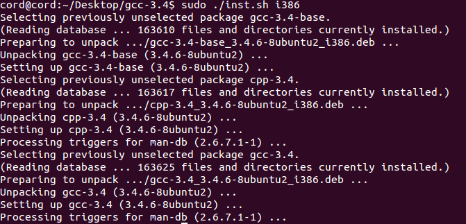
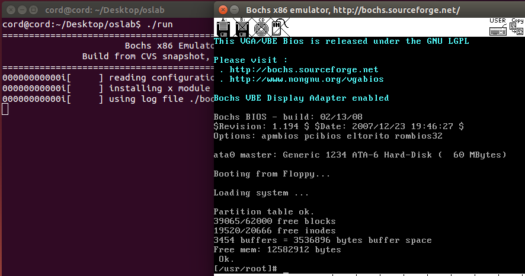

# 实验环境的搭建与使用

实验环境：Ubuntu 14.04

编译器：gcc 3.4.0

## 主要平台和工具简介

### x86 模拟器 Bochs

Bochs 是一个免费且开放源代码的 IA-32(x86) 架构 PC 机模拟器。在它模拟出的环境中可以运行 Linux、DOS 和各种版本的 Windows 等多种操作系统。而 Bochs 本身具有很高的移植性，可以运行在多种软硬件平台之上，这也是我们选择它做为本书的指定模拟器的主要原因。如果您想拥抱自由的Linux，那么Bochs几乎是您的不二选择。如果您想继续把自己绑定在 Windows 平台上，那么除了 Bochs，您还可以选用 VMware 或者 Microsoft Virtual PC。它们是最著名虚拟机软件，而且都可以免费使用。因为 Bochs 的是模拟器，其原理决定了它的运行效率会低于虚拟机。但对于本书所设计的实验来说，效率上的差别很不明显。而且，Bochs 有虚拟机无可比拟的调试操作系统的能力，所以我们更建议您选用 Bochs。hit-oslab 已经内置了 bochs，本书后文假定的缺省环境也是Bochs。

关于 Bochs 的更详细的介绍请访问它的主页及 [Bochs使用手册](https://hoverwinter.gitbooks.io/hit-oslab-manual/content/bochs-manual.html)。

### GCC 编译器

GCC 是和 Linux 一起成长起来的编译器。Linux 最初的版本就是由 GCC 编译的。现在 GCC 也是在自由软件领域应用最广泛的编译器。所以，我们也选择 GCC 做为本书实验的指定编译器。


### GDB 调试器

GDB 调试器是 GCC 编译器的兄弟。做为自由软件领域几乎是唯一的调试器，它秉承了 *nix 类操作系统的一贯风格，采用纯命令行操作，有点儿类似 dos 下的debug。关于它的使用方法请看 GDB 使用手册。


### Ubuntu (GNU/Linux)

现在，已经有越来越多的人开始用 Ubuntu 完全代替 Windows，享受更加自由、安全、守法的感觉。Ubuntu 的主页是 http://www.ubuntu.com/ ，这里不仅可以免费下载到 iso 文件，甚至能免费申领 Ubuntu 的安装光盘。

我们强烈建议您在 Ubuntu 下做实验。因为有些实验内容涉及到在自己改进的 Linux 0.11 下，运行自己编的应用程序。被改进的功能都是高版本 Linux 内核已经具有的，在其上确认自己编写的应用程序无误后，再用之测试自己改进的 Linux 0.11，可以更有信心些。


### 源代码阅读工具

实验过程中不可避免地要阅读 Linux 0.11 的源代码。源代码阅读工具能让这个过程的效率更高，烦恼更少。

http://www.oldlinux.org/lxr/http/source/ 是用 lxr 生成的一个 Linux 源代码阅读网站。只要用鼠标点击，就能轻松浏览 Linux 0.11 的源代码。

但在不能上网的时候，或者阅读的同时还要修改源代码，就要使用下面介绍的工具了。

在Linux下，ctags 可以和 VIM 或 Emacs 配合，一边浏览代码，一边编辑。在 Ubuntu 下这样安装：

```shell
$ sudo apt-get install exuberant-ctags
```

使用起来也不麻烦，网上资料很多，man 文档也很详细。在 Windows 下，Source Insight 是个不错的选择。


### 实验环境的工作模式

hit-oslab 实验环境简称 oslab，可在 github 的 Resource 中下载。oslab 工作在一个宿主操作系统之上，分为 Linux 版和Win32 版。其中 Linux 版主要针对 Ubuntu的 32 位和 64 位版设计，但稍加修改甚至完全不修改，也可以在其它Linux 发行版使用。这是我们主要推荐的版本。Win32 版主要针对 Windows XP 设计，不能很好地支持 Windows Vista。

在宿主操作系统之上完成对 Linux 0.11 的开发、修改和编译之后，在 linux-0.11 目录下会生产一个名为 Image 的文件，它就是编译之后的目标文件。该文件内已经包含引导和所有内核的二进制代码。如果拿来一张软盘，从它的 0 扇区开始，逐字节写入 Image 文件的内容，就可以用这张软盘启动一台真正的计算机，并进入 Linux 0.11 内核。oslab 采用 bochs 模拟器加载这个文件，模拟执行 Linux 0.11，这样省却了重新启动计算机的麻烦。

bochs 目录下是与 bochs 相关的执行文件、数据文件和配置文件。run 是运行 bochs 的脚本命令。运行后 bochs会自动在它的虚拟软驱 A 和虚拟硬盘上各挂载一个镜像文件，软驱上挂载是 linux-0.11/Image，硬盘上挂载的是hdc-0.11.img。因为 bochs 配置文件中的设置是从软驱 A 启动，所以 Linux 0.11 会被自动加载。而 Linux 0.11 会驱动硬盘，并 mount 硬盘上的文件系统，也就是将 hdc-0.11.img 内镜像的文件系统挂载到 0.11 系统内的根目录 “/”。在 0.11 下访问文件系统，访问的就是 hdc-0.11.img 文件内虚拟的文件系统。

hdc-0.11.img 文件的格式是 Minix 文件系统的镜像。Linux 所有版本都支持这种格式的文件系统，所以可以直接在宿主 Linux 上通过 mount 命令访问此文件内的文件，达到宿主系统和 bochs 内运行的 Linux 0.11 之间交换文件的效果。Windows下目前没有（或者是还没发现）直接访问 Minix 文件系统的办法，所以要借助于 fdb.img，这是一个 1.44M 软盘的镜像文件，内部是 FAT12 文件系统。将它挂载到 bochs 的软驱 B，就可以在 0.11 中访问它。而通过 filedisk 或者 WinImage，可以在 Windows 下访问它内部的文件。

hdc-0.11.img 内包含有：

1. Bash shell
2. 一些基本的Linux命令、工具，比如cp、rm、mv、tar。
3. vi 编辑器
4. gcc 1.4 编译器，可用来编译标准 C 程序
5. as86 和 ld86
6. Linux 0.11 的源代码，可在0.11下编译，然后覆盖现有的二进制内核
7. Linux 上的实验环境


## 环境搭建

操作系统：Ubuntu 14.04

在 github 的 Resource 中下载 Resource.zip 解压得到里面的 os-lab 源码。此文件包中包括下列内容：

1. 可在 Ubuntu 下编译的 Linux 0.11 内核源代码。

2. 已打开 gdb-stub 功能的 Bochs 及其支撑文件、配置文件。Ubuntu 自带的 Bochs 没有 gdb-stub 功能，不能用 GDB 进行 C 语言级的调试。

3. 可忽略 Signal 0 的 GDB 调试器。GDB是为调试应用程序而设计，而应用程序不需要处理signal 0，所以GDB捕获到signal 0后会强制暂停程序。Bochs（也许是 Linux 0.11内核）会产生大量的 signal 0，影响调试。我们给 GDB 打了一个补丁，使其可以忽略 signal 0。

4. 磁盘镜像文件 hdc-0.11-new.img。它是 Linux 0.11 的根文件系统，内含 gcc、vi 等开发工具和 bash 等常用工具。

5. 方便运行、调试和文件交换的一系列脚本。

6. 建议将 oslab.tar.gz 保存到你的 home 目录（/home/xxxx（xxxx是你的用户名））下。然后打开终端窗口，当前目录就是你的 home 目录。这个窗口是将来要使用的主要窗口。在提示符下执行如下命令（不包括那个“$”）解压缩下载的文件：

   ```shell
   $ tar zxf oslab.tar.gz
   ```


用 ls 命令列目录如果能看到 “oslab” 目录，就说明解压缩成功。这个目录下已经包括 Linux-0.11 源代码、Bochs、GDB 和一些数据文件及脚本。但我们还需要安装编译器和编辑器等开发环境。

在 Ubuntu 9.10 及之后，要先从 “资料和文件” 中下载 gcc-3.4-ubuntu.tar.gz 到 `/tmp` 目录，用下列命令安装：

```shell
$ cd /tmp
$ tar zxvf gcc-3.4-ubuntu.tar.gz
$ cd gcc-3.4
# ARCH 换为 i386 或 amd64
$ sudo ./inst.sh [ARCH] 
```




初始化必备的库：

```shell
# 先更新软件列表
$ sudo apt-get update
$ sudo apt-get install build-essential bin86 manpages-dev
```


## 使用方法

解压资源包中的 hit-oslab-linux-20110823.tar.gz，得到 oslab 文件夹。

### 准备活动

把当前目录切换到 oslab 下，用 pwd 命令确认，用 “ls -l” 列目录内容。本实验的所有内容都在本目录或其下级目录内完成。

```shell
$ cd ~/Work/oslab
```


### 编译内核

“编译内核” 比“ 编写内核” 要简单得多。首先要进入 linux-0.11 目录，然后执行：

```shell
$ cd ./linux-0.11
$ make all
```

因为 “all” 是最常用的参数，所以可以省略，只用 “make”，效果一样。

在多处理器的系统上，可以用 -j 参数进行并行编译，加快速度。例如双 CPU 的系统可以：

```shell
$ make -j 2
```

make 命令会显示很多很多很多的信息，你可以尽量去看懂，也可以装作没看见。只要最后几行中没有“error”就说明编译成功。最后生成的目标文件是一个软盘镜像文件——linux-0.11/Image。如果将此镜像文件写到一张1.44MB 的软盘上，就可以启动一台真正的计算机。

linux-0.11 目录下是全部的源代码，很多实验内容都是要靠修改这些代码来完成。修改后需要重新编译内核，还是执行命令：

```shell
$ make all
```

make 命令会自动跳过未被修改的文件，链接时直接使用上次编译生成的目标文件，从而节约编译时间。但如果重新编译后，你的修改貌似没有生效，可以试试先 “make clean”，再 “make all”。“make clean” 是删除上一次编译生成的所有中间文件和目标文件，确保是在全新的状态下编译整个工程。


## 运行和调试

在Bochs中运行最新编译好的内核很简单，在 oslab 目录下执行：

```shell
$ ./run
```

如果出现 Bochs 的窗口，里面显示 linux 的引导过程，最后停止在“[/usr/root/]#”，表示运行成功。



内核调试分为两种模式：汇编级调试和C语言级调试。

汇编级调试需要执行命令：

```shell
$ ./dbg-asm
```

可以用命令 help 来查看调试系统用的基本命令。更详细的信息请查阅Bochs使用手册。

C 语言级调试稍微复杂一些。首先执行如下命令：

```shell
$ ./dbg-c
```

然后再打开一个终端窗口，进入oslab目录后，执行：

```shell
$ ./rungdb
```

新终端窗口中运行的是 GDB 调试器。关于 gdb 调试器请查阅GDB使用手册。


## Ubuntu 和 Linux 0.11 之间的文件交换

oslab下的 hdc-0.11-new.img 是 0.11 内核启动后的根文件系统镜像文件，相当于在 bochs 虚拟机里装载的硬盘。在Ubuntu上访问其内容的方法是：

```shell
$ sudo ./mount-hdc
```

之后，hdc 目录下就是和 0.11 内核一模一样的文件系统了，可以读写任何文件（可能有些文件要用 sudo 才能访问）。读写完毕，不要忘了卸载这个文件系统：

```shell
$ sudo umount hdc
```

**注意**：

1. 不要在 0.11 内核运行的时候mount镜像文件，否则可能会损坏文件系统。同理，也不要在已经 mount 的时候运行 0.11 内核。
2. 在关闭 Bochs 之前，需要先在 0.11 的命令行运行 “sync”，确保所有缓存数据都存盘后，再关闭 Bochs。

