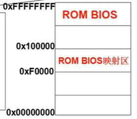
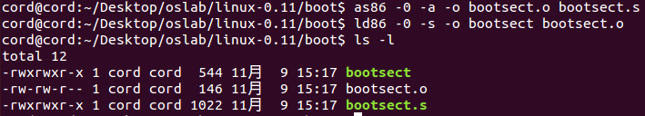
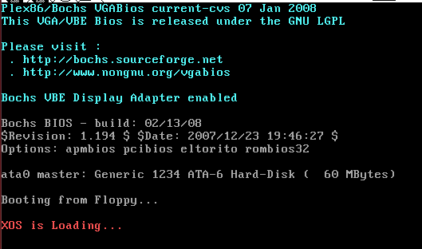
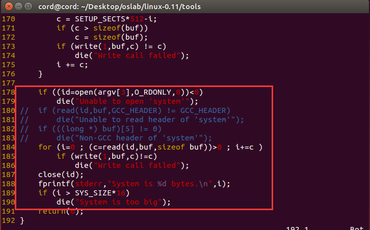
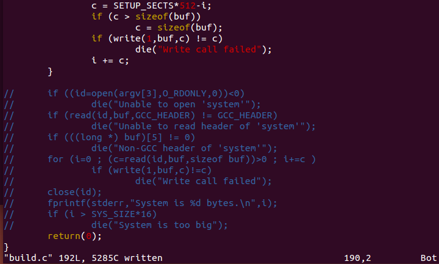
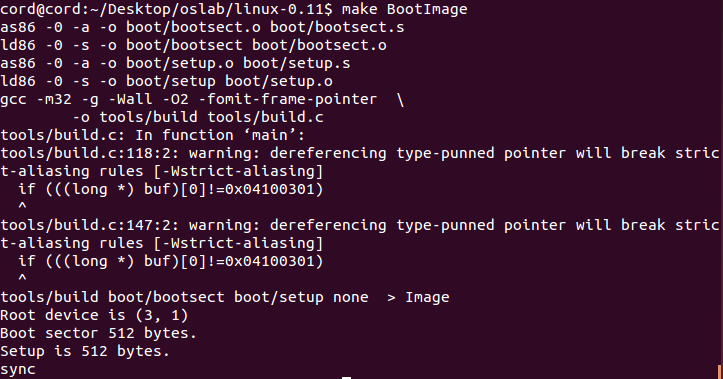
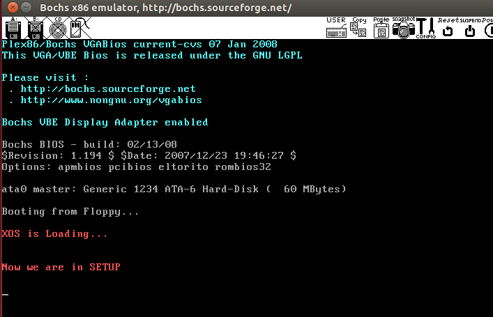
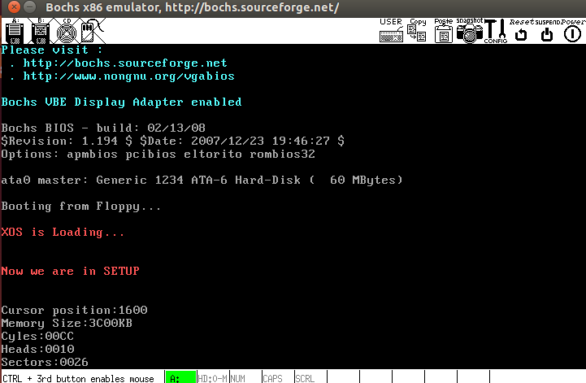

# 操作系统的引导

## 实验内容

实验内容为：

1. 实现 bootsect.s，放入引导扇区
2. bootsect.s 读入 setup.s
3. setup.s 获取基本硬件参数


## 实验理论

**阅读《Linux内核完全注释》的第6章，对计算机和 Linux 0.11 的引导过程进行初步的了解；**

x86 计算机启动过程：

1. x86 PC 刚开机时 CPU 处于实模式

2. 开机时，CS=0xFFFF; IP=0x0000

   实模式的寻址方式为`CS:IP`（CS 左移 4 位 + IP）。**注意这个方式和保护模式不一样。**

3. 寻址 0xFFFF0（ROM BIOS 映射区，只读存储）

4. 检查 RAM（主存），键盘，显示器，软硬磁盘

5. 将磁盘 0 磁道 0 扇区（引导扇区）读入 0x7C00 处（1 个扇区 512 字节）

6. 设置 CS=0x07C0，IP=0x0000，执行引导扇区的代码



模块作用：

1. bootset.s：引导操作系统启动，转到 setup 模块
2. setup.s：完成 OS 启动前的设置，进入保护模式（32 位工作模式）

这里我们主要使用到的中断是 BIOS 中断：中断向量表中第 0H～1FH 项是 BIOS 中断。

## 实现 bootsect.s 引导扇区

`linux-0.11/boot/bootsect.s`：

```assembly
entry _start

_start:
  ; 首先读入光标位置
  mov    ah, #0x03        
  xor    bh, bh
  int    0x10

  ; 显示字符串 "XOS is Loading..."
  ; BIOS 中断 0x10 功能号 ah = 0x13, 显示字符串
  ; al = 放置光标的方式及规定属性。0x01 表示使用 bl 中的属性值,光标停在字符串结尾处。
  ; bh = 显示页面号, bl = 字符属性。
  ; cx = 显示的字符串字符数, 这里是 2+15+6=23,即 msg1 所占的字符。
  ; es:bp 指向需显示的字符串起始位置处
  mov    cx, #23
  mov    bx, #0x0007
  mov    bp, #msg1
  mov 	 ax, #0x07c0
  mov    es, ax
  mov    ax, #0x1301
  int    0x10

inf_loop:
  jmp    inf_loop 	; 死循环

; msg1 处放置字符串
msg1:
  .byte 13,10                     ; 换行 + 回车
  .ascii "XOS is Loading..."
  .byte 13,10,13,10               ; 两对换行 + 回车
    
.org 510
; 设置引导扇区标记 0xAA55   
; boot_flag的 2 个魔数在最后 2 个字节
boot_flag:
  .word 0xAA55
```

接下来，将完成屏幕显示的代码在开发环境中编译，并使用 `linux-0.11/tools/build.c` 将编译后的目标文件做成 Image 文件。

## 编译和运行

Ubuntu上先从终端进入 `linux-0.11/boot/` 目录，执行下面两个命令编译和链接 bootsect.s：

```shell
$ as86 -0 -a -o bootsect.o bootsect.s
$ ld86 -0 -s -o bootsect bootsect.o
```

1. `-0` 表示生成 8086 的 16 位目标程序
2. `-a` 表示生成与 GNU as 和 ld 部分兼容的代码
3. `-s` 告诉链接器 ld86 去除最后生成的可执行文件中的符号信息。



需要留意的文件是 bootsect 的文件大小是 544 字节，而引导程序必须要正好占用一个磁盘扇区，即 512 个字节。造成多了 32 个字节的原因是 ld86 产生的是 Minix 可执行文件格式，这样的可执行文件处理文本段、数据段等部分以外，还包括一个 Minix 可执行文件头部，它的结构如下：

```c++
struct exec {
  unsigned char a_magic[2];  							// 执行文件魔数
  unsigned char a_flags;
  unsigned char a_cpu;       							// CPU标识号
  unsigned char a_hdrlen;    							// 头部长度，32字节或48字节
  unsigned char a_unused;
  unsigned short a_version;
  long a_text; long a_data; long a_bss; 	// 代码段长度、数据段长度、堆长度
  long a_entry;    												// 执行入口地址
  long a_total;    												// 分配的内存总量
  long a_syms;     												// 符号表大小 
};
```

6 char（6字节）+1 short（2 字节）+ 6 long（24 字节）= 32，正好是 32 个字节。要去掉这 32 个字节的文件头部（`linux-0.11/tools/build.c` 的功能之一就是这个）。

Ubuntu 下用命令：

```shell
$ dd bs=1 if=bootsect of=Image skip=32
```

去掉这 32 个字节后，将生成的文件拷贝到 linux-0.11目录下，并一定要命名为 Image（注意大小写）。



## bootsect.s 读入 setup.s

首先编写一个 setup.s，该 setup.s 可以就直接拷贝前面的 bootsect.s，然后将其中的显示的信息改为：“Now we are in SETUP”。

`linux-0.11/boot/setup.s`：

```assembly
entry _start

_start:
  ; 首先读入光标位置
  mov    ah, #0x03        
  xor    bh, bh
  int    0x10

  ; 显示字符串 "Now we are in SETUP"
  mov    cx, #25
  mov    bx, #0x000c
  mov    bp, #msg1
  mov    ax, cs
  mov    es, ax
  mov    ax, #0x1301
  int    0x10

inf_loop:
  jmp    inf_loop

; msg1 处放置字符串
msg1:
  .byte 13,10                     ; 换行 + 回车
  .ascii "Now we are in SETUP"
  .byte 13,10,13,10               ; 两对换行 + 回车

.org 510

boot_flag:
  .word 0xAA55
```


在 bootsect.s 中载入 setup.s，`linux-0.11/boot/bootsect.s`：

```assembly
BOOTSEG     = 0x07c0    ; 左移4位后就是0x7c00, 占512B, 所以偏移512B(0x0200)后得0x7e00
SETUPSEG    = 0x07e0        
SETUPLEN    = 2

entry _start
_start:
  ; 首先读入光标位置
  mov    ah, #0x03        
  xor    bh, bh
  int    0x10

  ; 显示字符串 "XOS is Loading..."
  ; BIOS中断0x10 功能号ah = 0x13, 显示字符串
  ; input : al = 放置光标的方式及规定属性。0x01表示使用bl中的属性值,光标停在字符串结尾处。
  ; bh = 显示页面号, bl = 字符属性。
  ; cx = 显示的字符串字符数, 这里是 17+6=23, 即 msg1 所占的字符。
  ; es:bp 指向需显示的字符串起始位置处
  mov    cx, #23
  mov    bx, #0x000c
  mov    bp, #msg1
  mov    ax, #BOOTSEG  
  mov    es, ax
  mov    ax, #0x1301
  int    0x10

; 加载 setup
load_setup:
  mov dx, #0x0000
  mov cx, #0x0002  ; 扇区不是从 0 开始的, 而是从 1 开始的, 1是 bootsect 所在的扇区, setup 从扇区 2 开始
  mov bx, #0x200   ; es:bx 指向将要存放的内存地址
  mov ax, #0x0200+SETUPLEN   ; 读 2 个扇区到内存
  int 0x13
  jnc ok_load_setup  	; 成功就跳转到 ok_load_setup 执行
  mov dx, #0x0000
  mov ax, #0x0000     	; 复位软盘
  int 0x13
  jmp load_setup

  ; 跳转到setup执行
  ok_load_setup:
  jmpi 0, SETUPSEG   ; 段间跳转指令  cs = SETUPSEG, ip = 0

; msg1 处放置字符串
msg1:
  .byte 13,10                     ; 换行 + 回车
  .ascii "XOS is Loading..."
  .byte 13,10,13,10               ; 两对换行 + 回车


.org 510

; boot_flag的2个魔数在最后2个字节
boot_flag:
  .word 0xAA55
```

修改 build.c 完成我们我们对这两个文件的编译：

build.c 从命令行参数得到 bootsect、setup 和 system 内核的文件名，将三者做简单的整理后一起写入 Image，这里我们缺少了 system 文件，注释掉相关部分即可。





编译：



运行：



## setup.s 获取基本硬件参数

用 `ah=#0x03` 调用 0x10 中断可以读出光标的位置，用 `ah=#0x88` 调用 0x15 中断可以读出内存的大小。有些硬件参数的获取要稍微复杂一些，如磁盘参数表。

在 PC 机中 BIOS 设定的中断向量表中 int 0x41 的中断向量位置 `(4*0x41 = 0x0000:0x0104)` 存放的并不是中断程序的地址，而是第一个硬盘的基本参数表。第二个硬盘的基本参数表入口地址存于 int 0x46 中断向量位置处。每个硬盘参数表有 16 个字节大小。

下表给出了硬盘基本参数表的内容：

| 位移 | 大小 | 说明         |
| :--- | :--- | :----------- |
| 0x00 | 字   | 柱面数       |
| 0x02 | 字节 | 磁头数       |
| …    | …    | …            |
| 0x0E | 字节 | 每磁道扇区数 |
| 0x0F | 字节 | 保留         |

所以获得磁盘参数的方法就是复制数据。


以十六进制方式显示整数比较简单，因为十六进制与二进制有很好的对应关系（每4位二进制数和1位十六进制数存在一一对应关系）。显示时只需将原二进制数每4位划成一组，按组求对应的 ASCII 码送显示器即可。

ASCII 码与十六进制数字的对应关系为：0x30～0x39 对应数字 0～9，0x41～0x46 对应字母 A～F。需要注意的是，从数字 9 到字母 A，其 ASCII 码间隔了 7 (0x41 - 0x3A = 7)，这一点在转换时要特别注意。

为使一个十六进制数能按高位到低位依次显示，实际编程中，需要对 `BX` 中的数每次循环左移一组（4 位二进制），然后屏蔽掉当前高 12 位，对当前余下的 4 位（即1位十六进制数）求其 ASCII 码。如果余下的 4 位是 0～9，则加 0x30 得对应的 ASCII 码，如果是 A～F，则加 0x37 才行，最后送显示器输出。以上步骤重复 4 次，就可以完成 `BX` 中数以 4 位十六进制的形式显示出来。

下面是完成显示 16 进制数的汇编语言程序的关键代码，其中用到的 BIOS 中断为 `INT 0x10`，功能号 0x0E（显示一个字符），即 `AH=0x0E`，`AL= 要显示字符的ASCII码`。

```assembly
; 以16进制方式打印栈顶的16位数
print_hex:
  mov    cx, #4 		; 4个十六进制数字
  mov    dx, (bp) 	; 将(bp)所指的值放入dx中, 如果bp是指向栈顶的话
   
print_digit:
  rol    dx, #4        ; 循环以使低4比特用上 ;; 取dx的高4比特移到低4比特处。
  mov    ax, #0xe0f    ; ah = 请求的功能值,al = 半字节(4个比特)掩码。
  and    al, dl        ; 取dl的低4比特值。
  add    al, #0x30     ; 给al数字加上十六进制0x30
  cmp    al, #0x3a
  jl     outp          ; 是一个不大于十的数字
  add    al, #0x07     ; 是a~f,要多加7

outp: 
  int    0x10
  loop    print_digit
  ret

; 打印回车换行
print_nl:
  mov    ax,#0xe0d    ; CR
  int    0x10
  mov    al,#0xa     	; LF
  int    0x10
  ret
```

这里用到了一个 loop 指令，每次执行 loop 指令，cx 减 1，然后判断 cx 是否等于0。如果不为0则转移到loop指令后的标号处，实现循环；如果为0顺序执行。另外还有一个非常相似的指令：rep指令，每次执行rep指令，cx减1，然后判断cx是否等于0，如果不为0则继续执行rep指令后的串操作指令，直到cx为0，实现重复。


实际实现过程中，我们直接传入 2 字节的数据，循环打印即可，不用实现栈逻辑。


最终实现的 setup.s（`linux-0.11/boot/setup.s`）：

```assembly
INITSEG = 0x9000

entry _start

_start:
  ; 首先读入光标位置
  mov    ah, #0x03        
  xor    bh, bh
  int    0x10

  ; 显示字符串 "Now we are in SETUP"
  mov    cx, #25
  mov    bx, #0x000c
  mov    bp, #msg1
  mov    ax, cs
  mov    es, ax
  mov    ax, #0x1301
  int    0x10

	; 将硬件参数取出来放在内存0x90000处
	mov ax, #INITSEG
	mov ds, ax      ; 数据段的基地址 0x9000

  ; 读光标位置
	xor bh, bh
	mov ah, #0x03
	int 0x10
	mov [0], dx     ; dh=行号,dl=列号

  ; 读扩展内存大小
	mov ah, #0x88
	int 0x15
	mov [2], ax

  ; 从0x41处拷贝16个字节(磁盘参数表)
  ; 读第1个磁盘参数表,共16个字节大小. 其首地址在int 0x41的中断向量位置
	; 中断向量表的起始地址是0x000, 共1KB大小, 并且每个表项占4B
	; 所以第1个磁盘参数表的首地址的地址:0x41*4=0x104, 此处4B由段地址和偏移地址组成
   mov ax, #0x0000
	mov ds,ax           ; 中断向量表的起始地址
	lds si, [4*0x41]    ; 先存入的是偏移地址,取出存到si中. 取出的4个字节,高位存入ds,低位存入si
	
	mov ax, #INITSEG
	mov es, ax
	mov di, #0x0004     ; 光标和内存已经占用4B

	mov cx, #16
	rep
  movsb

; 打印前的准备
	mov ax, cs
	mov es, ax      ; setup 所在的代码段	
	mov ax, #INITSEG
	mov ds, ax      ; 数据段, 指向参数所在的地方

; 显示光标位置
	mov ah, #0x03
	xor bh, bh
	int 0x10
	
	mov cx, #18             ; 长度 : 16 + 2
	mov bx, #0x0007
	mov bp, #msg_cursor     ; "Cursor position:" es:bp
	mov ax, #0x1301
	int 0x10

	; 存好的光标位置读出存到 dx 中, 那没必要再读光标了吧. 显示字符串需要放置光标，所以要读
    ; 打印光标位置
	mov dx, [0] 
	call print_hex

; 显示内存大小
	mov ah, #0x03
	xor bh, bh
	int 0x10
	
	mov cx, #14          ; 长度12+2
	mov bx, #0x0007
	mov bp, #msg_memory  ; "Memory Size:"
	mov ax, #0x1301
	int 0x10
	mov dx, [2]
	call print_hex	

; 补上KB
	mov ah, #0x03
	xor bh, bh
	int 0x10
	
	mov cx, #2
	mov bx, #0x0007
	mov bp, #msg_kb
	mov ax, #0x1301
	int 0x10

; 柱面, cylinder Cyles
	mov ah, #0x03
	xor bh, bh
	int 0x10
	
	mov cx, #8
	mov bx, #0x0007
	mov bp, #msg_cyles
	mov ax, #0x1301
	int 0x10
	mov dx, [4]         ; 4 + 0
	call print_hex
	
; 磁头 Heads
	mov ah,#0x03
	xor bh,bh
	int 0x10
	
	mov cx, #8
	mov bx, #0x0007
	mov bp, #msg_heads
	mov ax, #0x1301
	int 0x10
	mov dx, [6]        ; 4 + 2
	call print_hex
	
; 扇区 sectors
	mov ah,#0x03
	xor bh,bh
	int 0x10
	
	mov cx, #10
	mov bx, #0x0007
	mov bp, #msg_sectors
	mov ax, #0x1301
	int 0x10
	mov dx, [0x12]
	call print_hex
	
inf_loop:
	jmp inf_loop


; 以16进制方式打印栈顶的16位数
print_hex:
    mov    cx, #4 		; 4个十六进制数字
    ; mov    dx, (bp) 	; 将(bp)所指的值放入dx中, 如果bp是指向栈顶的话
   
print_digit:
    rol    dx, #4        ; 循环以使低4比特用上, 取dx的高4比特移到低4比特处。
    mov    ax, #0xe0f    ; ah = 请求的功能值,al = 半字节(4个比特)掩码。
    and    al, dl        ; 取dl的低4比特值。
    add    al, #0x30     ; 给al数字加上十六进制0x30
    cmp    al, #0x3a
    jl     outp          ; 是一个不大于十的数字
    add    al, #0x07     ; 是a~f,要多加7

outp: 
    int    0x10
    loop    print_digit
    ret

; 打印回车换行
print_nl:
    mov    ax,#0xe0d    ; CR
    int    0x10
    mov    al,#0xa     	; LF
    int    0x10
    ret

; msg1 处放置字符串
msg1:
    .byte 13,10                     ; 换行 + 回车
    .ascii "Now we are in SETUP"
    .byte 13,10,13,10               ; 两对换行 + 回车

msg_cursor:
	.byte 13,10
	.ascii "Cursor position:"

msg_memory:
    .byte 13,10
	.ascii "Memory Size:"
	  
msg_cyles:
    .byte 13,10
    .ascii "Cyles:"
          
msg_heads:
    .byte 13,10
    .ascii "Heads:"
          
msg_sectors:
    .byte 13,10
    .ascii "Sectors:"
           
msg_kb:
    .ascii "KB"

.org 510

boot_flag:
    .word 0xAA55
```





Memory Size 是 0x3C00 KB，算一算刚好是15MB（扩展内存），加上 1MB 正好是16MB，看看 Bochs 配置文件 `bochs/bochsrc.bxrc`：

```ini
......
megs: 16
......
ata0-master: type=disk, mode=flat, cylinders=410, heads=16, spt=38
......
```

实验与虚拟机的配置吻合。

