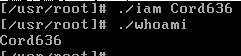
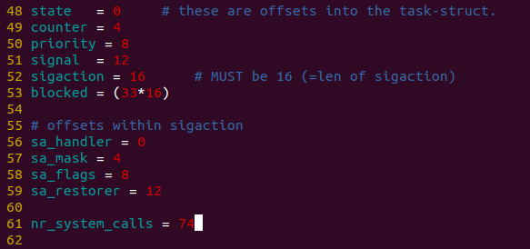
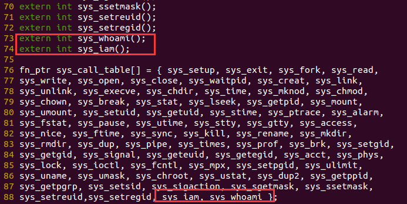
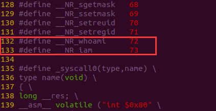
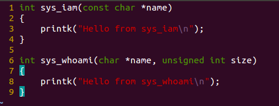
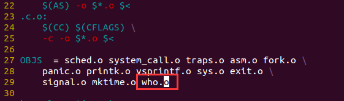
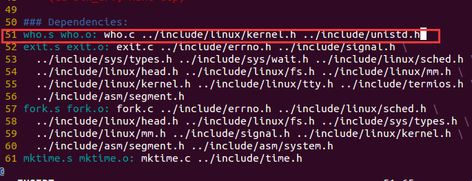
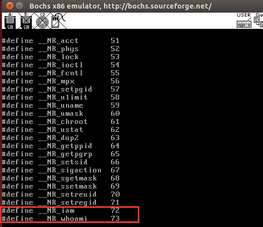
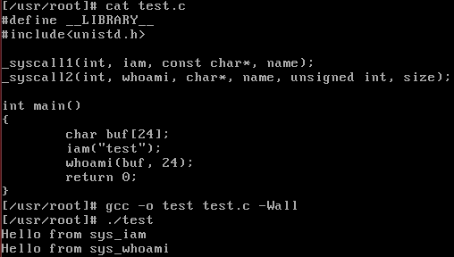
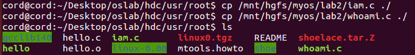

# 系统调用

## 实验内容

在 Linux 0.11 上添加两个系统调用，并编写两个简单的应用程序测试它们。

## 系统调用原型

### iam()

第一个系统调用是 `iam()`，其原型为：

```c++
int iam(const char * name);
```

完成的功能是将字符串参数 name 的内容拷贝到内核中保存下来。要求 name 的长度不能超过 23 个字符。返回值是拷贝的字符数。如果 name 的字符个数超过了 23，则返回 “-1”，并置 errno 为 EINVAL。

在 `kernal/who.c` 中实现此系统调用。

### whoami()

第二个系统调用是 `whoami()`，其原型为：

```c++
int whoami(char* name, unsigned int size);
```

它将内核中由`iam()` 保存的名字拷贝到 name 指向的用户地址空间中，同时确保不会对 name 越界访存（name 的大小由 size 说明）。返回值是拷贝的字符数。如果 size 小于需要的空间，则返回 “-1”，并置 errno 为 EINVAL。

也是在 `kernal/who.c` 中实现。


### 测试程序

运行添加过新系统调用的 Linux 0.11，在其环境下编写两个测试程序 iam.c 和 whoami.c。最终的运行结果是：



**注意：首先，请将 Linux 0.11 的源代码恢复到原始状态。**

## 实验理论

操作系统实现系统调用的基本过程是：

1. 应用程序调用库函数（API）；
2. API 将系统调用号存入 EAX，然后通过中断调用使系统进入内核态；
3. 内核中的中断处理函数根据系统调用号，调用对应的内核函数（系统调用）；
4. 系统调用完成相应功能，将返回值存入 EAX，返回到中断处理函数；
5. 中断处理函数返回到 API 中；
6. API 将 EAX 返回给应用程序。


### 应用程序调用系统调用

在通常情况下，调用系统调用和调用一个普通的自定义函数在代码上并没有什么区别，但调用后发生的事情有很大不同。调用自定义函数是通过 call 指令直接跳转到该函数的地址，继续运行。而调用系统调用，是调用系统库中为该系统调用编写的一个接口函数，叫 API（Application Programming Interface）。API 并不能完成系统调用的真正功能，它要做的是去调用真正的系统调用，过程是：

1. 把系统调用的编号存入EAX
2. 把函数参数存入其它通用寄存器
3. 触发 0x80 号中断（int 0x80）

0.11 的 lib 目录下有一些已经实现的 API。Linus 编写它们的原因是在内核加载完毕后，会切换到用户模式下，做一些初始化工作，然后启动 shell。而用户模式下的很多工作需要依赖一些系统调用才能完成，因此在内核中实现了这些系统调用的 API。我们不妨看看 lib/close.c，研究一下 `close()` 的 API：

```c++
#define __LIBRARY__
#include <unistd.h>
_syscall1(int, close, int, fd)
```

其中 `_syscall1` 是一个宏，在 `include/unistd.h` 中定义。将 `_syscall1(int, close, int, fd)` 进行宏展开，可以得到：

```c++
int close(int fd) 
{ 
    long __res;      
    __asm__ volatile ("int $0x80" 
        : "=a" (__res) 
        : "0" (__NR_close),"b" ((long)(fd)));      
    if (__res >= 0)
        return (int) __res; 
    errno = -__res; 
    return -1; 
}
```

这就是 API 的定义。它先将宏 `__NR_close` 存 入EAX，将参数 fd 存入 EBX，然后进行 0x80 中断调用。调用返回后，从 EAX 取出返回值，存入 `__res`，再通过对 `__res` 的判断决定传给 API 的调用者什么样的返回值。其中`__NR_close` 就是系统调用的编号，在 include/unistd.h 中定义：

```c++
#define __NR_close    6
```

所以添加系统调用时需要修改 `include/unistd.h` 文件，使其包含 `__NR_whoami` 和 `__NR_iam`。而在应用程序中，要有：

```c++
#define __LIBRARY__                 /* 有它，_syscall1 等才有效。详见 unistd.h */
#include <unistd.h>                	/* 有它，编译器才能获知自定义的系统调用的编号 */
/* iam() 在用户空间的接口函数 */
_syscall1(int, iam, const char*, name);  
/* whoami() 在用户空间的接口函数 */
_syscall2(int, whoami, char*, name, unsigned int, size);
```

在 0.11 环境下编译 C 程序，包含的头文件都在 `/usr/include` 目录下。该目录下的 unistd.h 是标准头文件（它和 0.11 源码树中的 unistd.h 并不是同一个文件，虽然内容可能相同），没有 `__NR_whoami` 和 `__NR_iam` 两个宏，需要手工加上它们，也可以直接从修改过的 0.11 源码树中拷贝新的 unistd.h 过来。


### int 0x80 进入内核函数

int 0x80 触发后，接下来就是内核的中断处理了。先了解一下 0.11 处理 0x80 号中断的过程。

在内核初始化时，主函数（在 init/main.c 中，Linux 实验环境下是 `main()`，Windows 下因编译器兼容性问题被换名为 `start()`）调用了 `sched_init()` 初始化函数：

```c++
void main(void)    {            
  ......;
  time_init();
  sched_init();
  buffer_init(buffer_memory_end);
  ......;
}
```

`sched_init()` 在 kernel/sched.c 中定义为：

```c++
void sched_init(void) {
  ......;
  set_system_gate(0x80, &system_call);
}
```

`set_system_gate` 是个宏，在 `include/asm/system.h` 中定义为：

```c++
#define set_system_gate(n,addr) \
    _set_gate(&idt[n],15,3,addr)
```

`_set_gate` 的定义是：

```c++
#define _set_gate(gate_addr,type,dpl,addr) \
__asm__ ("movw %%dx,%%ax\n\t" \
    "movw %0,%%dx\n\t" \
    "movl %%eax,%1\n\t" \
    "movl %%edx,%2" \
    : \
    : "i" ((short) (0x8000+(dpl<<13)+(type<<8))), \
    "o" (*((char *) (gate_addr))), \
    "o" (*(4+(char *) (gate_addr))), \
    "d" ((char *) (addr)),"a" (0x00080000))
```

虽然看起来挺麻烦，但实际上很简单，就是填写 IDT（中断描述符表），将 system_call 函数地址写到 0x80 对应的中断描述符中，也就是在中断 0x80 发生后，自动调用函数 system_call。具体细节请参考《注释》的第4章。接下来看 system_call。该函数纯汇编打造，定义在 `kernel/system_call.s` 中：

```assembly
......
nr_system_calls = 72        			; 这是系统调用总数。如果增删了系统调用，必须做相应修改
......
.globl system_call
.align 2
system_call:
cmpl $nr_system_calls-1, %eax 		; 检查系统调用编号是否在合法范围内
ja bad_sys_call
push %ds
push %es
push %fs
pushl %edx
pushl %ecx        
pushl %ebx        								; push %ebx,%ecx,%edx，是传递给系统调用的参数
movl $0x10,%edx        						; 让ds,es指向GDT，内核地址空间
mov %dx,%ds
mov %dx,%es
movl $0x17,%edx        						; 让fs指向LDT，用户地址空间
mov %dx,%fs
call sys_call_table(,%eax,4)
pushl %eax
movl current,%eax
cmpl $0,state(%eax)
jne reschedule
cmpl $0,counter(%eax)
je reschedule
```

system_call 用 .globl 修饰为其他函数可见。Windows 实验环境下会看到它有一个下划线前缀，这是不同版本编译器的特质决定的，没有实质区别。call sys_call_table(,%eax,4) 之前是一些压栈保护，修改段选择子为内核段，call sys_call_table(,%eax,4) 之后是看看是否需要重新调度，这些都与本实验没有直接关系，此处只关心 call sys_call_table(,%eax,4) 这一句。根据汇编寻址方法它实际上是：

```assembly
call sys_call_table + 4 * %eax   ; 其中eax中放的是系统调用号，即__NR_xxxxxx
```

显然，sys_call_table 一定是一个函数指针数组的起始地址，它定义在 `include/linux/sys.h` 中：

```c
fn_ptr sys_call_table[] = { sys_setup, sys_exit, sys_fork, sys_read, ......
```

增加实验要求的系统调用，需要在这个函数表中增加两个函数引用—— sys_iam 和 sys_whoami。当然该函数在  sys_call_table 数组中的位置必须和 __NR_xxxxxx 的值对应上。同时还要仿照此文件中前面各个系统调用的写法，加上：

```c
extern int sys_whoami();
extern int sys_iam();
```


## 初步实现 sys_iam() 和 sys_whoami()

实验步骤：

1. 修改系统调用总数。系统调用总数从 72 变成 74，文件：kernel/system_call.s：

   

2. 在系统调用函数表中增加系统调用条目，并增加函数指针，文件：`include/linux/sys.h`：

   

3. 添加 iam 和 whoami 系统调用编号的宏定义（_NR_xxxxxx），文件：`include/unistd.h`

   

4. 实现 sys_iam 和 sys_whoami，文件：`kernel/who.c`

   

5. 修改Makefile 文件：`kernel/Makefile`

   

   

6. 进入linux-0.11，编写应用程序进行测试

   给用户层添加调用接口：

   

   

   执行 sync 确保内存缓冲区的数据写入磁盘，不然的话重新进入 linux-0.11 得重新增加宏定义。

7. 编写测试文件：`test.c`

   ```c
   #define __LIBRARY__   /* 必须定义这个宏 */
   #include <unistd.h>
   
   /* iam 和 whoami 系统调用的用户接口, 使用宏展开成调用 int 中断的函数形式 */
   _syscall1(int, iam, const char*, name);
   _syscall2(int, whoami, char*, name, unsigned int, size);
   
   int main(void) {
     char buf[24];
     iam("test");
     whoami(buf, 24);
     return 0;
   }
   ```
   
8. 运行结果

   


## 完全实现 sys_iam() 和 sys_whoami()

1. 内核中的代码实现程序：

   ```c
   #include <string.h> 			// 实现置 errno 为 EINVAL
   #include <errno.h> 				// 调用了 strcpy
   #include <asm/segment.h> 	// 调用了 get_fs_byte, put_fs_byte
   
   #define maxSize 24
   char msg[maxSize]; 				// 这样就可以在内核中保存下来，最后一位是'\0'
   
   int sys_iam(const char *name) {
     char tmp[maxSize];
     int i;
     for(i = 0; i < maxSize; i++) {
       // get_fd_byte 从用户空间取出一个字节
       tmp[i] = get_fs_byte(name + i);
       //printk("%c\n", tmp[i]);
       // '\0' 表示字符串结束了
       if(tmp[i] == '\0') {  	
   
         break;
       }
     }
     if(i == maxSize) {
       // printk("too long!\n");
       return -EINVAL;
     } else {
       strcpy(msg, tmp);
       return i;
     }
   }
   
   int sys_whoami(char *name, unsigned int size) {
     int msg_size = 0;
     while(msg[msg_size] != '\0') {
       msg_size ++;
     }
     // printk("msg_size : %d\n", msg_size);
     // printk("msg : %s\n", msg);
     if(size < msg_size) {
       return -EINVAL;
     } else {
       int i;
       //printk("size : %d\n", size);
       for(i = 0; i < size; i++) {
         // printk("ok\n");
         // printk("name : %c\n", name[i]);
         // printk("msg : %c\n", msg[i]);
         // 将一个字符放到用户空间
         put_fs_byte(msg[i], name + i);
         if(msg[i] == '\0') {
           break;
         }
       }
       return i;
     }
   }
   
   ```

2. 编写两个简单的用户态应用程序进行测试：

   iam.c：

   ```c
   #define __LIBRARY__ // _syscalln 才有效
   #include <unistd.h> // 编译器才能获知自定义的系统调用的编号
   
   _syscall1(int, iam, const char *, name);
   
   int main(int argc, char **argv) {
     iam(argv[1]);
     return 0;
   }
   ```
   
   whoami.c：
   
   ```c
   #define __LIBRARY__ 	// _syscalln才有效
   #include <unistd.h> 	// 编译器才能获知自定义的系统调用的编号
   #include <stdio.h>
   
   _syscall2(int, whoami, char *, name, unsigned int, size);
   
   int main() {
     char s[30];
     whoami(s, 30);
     printf("%s\n", s);
     return 0;
   }
   ```
   
   可以挂载虚拟机硬盘，然后将写好的文件送进硬盘：
   
   
   
   记得完成后取消挂载：
   
   ```shell
   $ sudo umount hdc
   ```
   
3. 运行测试程序

   结果：

   


`get_fs_byte()` 源码分析：

```c
extern inline unsigned char get_fs_bytes(const char * addr){
	unsigned register char v;
	__asm__("movb %%fs:%1,%0":"=r"(_v):"m"(*addr));
	return _v;
}
```

在 x86 架构中，`fs` 段寄存器通常用于访问用户空间的数据。Linux 内核使用 `fs` 段寄存器来区分用户空间和内核空间的地址访问。当内核代码在执行时，`fs` 段寄存器可以被设置为指向用户空间，使得内核能够安全地读取用户空间的数据。

CR3 寄存器：它的主要功能还是用来存放页目录表物理内存基地址，每当进程切换时，Linux 就会把下一个将要运行进程的页目录表物理内存基地址等信息存放到 CR3 寄存器中。
