# 进程运行轨迹的追踪与统计

## 实验内容

实验内容：

1. 基于模板 process.c 编写多进程的样本程序，实现如下功能：

   1. 所有子进程都并行运行，每个子进程的实际运行时间一般不超过 30 秒；

   1. 父进程向标准输出打印所有子进程的 id，并在所有子进程都退出后才退出；

2. 在 Linux0.11 上实现进程运行轨迹的跟踪。

   基本任务是在内核中维护一个日志文件 `/var/process.log`，把从操作系统启动到系统关机过程中所有进程的运行轨迹都记录在这一 log 文件中。

   `/var/process.log` 文件的格式必须为：pid X time。其中：

   1. pid 是进程的 ID；
   2. X 的种类：
      1. 进程新建（N）
      2. 进入就绪态（J）
      3. 进入运行态（R）
      4. 进入阻塞态（W）
      5. 退出（E）
   3. time表示 X 发生的时间。这个时间不是物理时间，而是系统的滴答时间（tick）；


在 Ubuntu 下，top 命令可以监视即时的进程状态。在 top 中，按 u，再输入你的用户名，可以限定只显示以你的身份运行的进程，更方便观察。按 h 可得到帮助。

注意：代码文本模式都需要修改为 `unix`，在 vim 命令行模式下 `set ff = unix`

## 实验理论

### jiffies（滴答）

jiffies在 `kernel/sched.c` 文件中定义为一个全局变量：

```c
long volatile jiffies=0;
```

它记录了从开机到当前时间的时钟中断发生次数。在 `kernel/sched.c` 文件中的 `sched_init()` 函数中，时钟中断处理函数被设置为：

```c
set_intr_gate(0x20, &timer_interrupt);
```

而在 `kernel/system_call.s` 文件中将 timer_interrupt 定义为：

```assembly
timer_interrupt:
......
incl jiffies     #增加jiffies计数值
......
```

这说明 jiffies 表示从开机时到现在发生的时钟中断次数，这个数也被称为“滴答数”。

另外，在 `kernel/sched.c` 中的 `sched_init()` 中有下面的代码：

```c
outb_p(0x36, 0x43); // 设置 8253 模式
outb_p(LATCH&0xff, 0x40);
outb_p(LATCH>>8, 0x40);
```

这三条语句用来设置每次时钟中断的间隔，即为 LATCH，而 LATCH 是定义在文件 `kernel/sched.c` 中的一个宏：

```c
#define LATCH  (1193180/HZ)
#define HZ 100  //在include/linux/sched.h中
```

再加上 PC 机 8253定时芯片的输入时钟频率为 1.193180MHz，即 1193180/每秒，LATCH=1193180/100，时钟每跳 11931.8 下产生一次时钟中断，即每 1/100秒（10ms）产生一次时钟中断，所以 jiffies 实际上记录了从开机以来共经过了多少个 10ms。

## 基于模板 process.c 编写多进程的样本程序

### fork() 函数

`fork()` 的返回值：

1. 在父进程中，fork 返回新创建子进程的进程 ID；
2. 在子进程中，fork 返回 0；
3. 如果出现错误，fork 返回一个负值；

```c
#include <stdio.h>
#include <unistd.h>

int main(int argc, char *argv[]) {
  int id = fork();
  printf("id = %d\n", id);
  if (!id) {
    printf("id == %d\n", id);
    printf("I am child [%d] and my parent is [%d].\n", getpid(), getppid());
  }
  return 0;
}
```

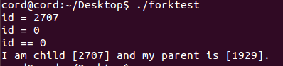


### wait() 函数

在父进程中调用 **wait(NULL)** 的效果：阻塞父进程，等待子进程结束。如果子进程结束，则返回子进程的 pid；如果没有子进程则立刻返回 -1。如果有多个子进程，则任意一个子进程结束时，wait 函数就会返回子进程的 pid。

等所有子进程结束，父进程才结束的方式：

```c
while(wait(NULL) != -1);
```


### process.c 测试程序

任务：创建多个子进程，每个子进程有一个持续时间 last。模拟切换过程，子进程每次可以使用 CPU 时间为 cpu_time ，每次 io 时间为 io_time。

process.c：

```c
#include <stdio.h>
#include <unistd.h>
#include <time.h>
#include <sys/times.h>

#define HZ 100 // 每1/100秒产生1次时钟中断。

void cpuio_bound(int last, int cpu_time, int io_time);

int main(int argc, char *argv[]) {
  if (!fork()) {
    printf("I am child [%d] and my parent is [%d].\n", getpid(), getppid());
    fflush(stdout);
    cpuio_bound(10, 1, 0);
    return 0;
  }
  if (!fork()) {
    printf("I am child [%d] and my parent is [%d].\n", getpid(), getppid());
    fflush(stdout);
    cpuio_bound(10, 0, 1);
    return 0;
  }
  if (!fork()) {
    printf("I am child [%d] and my parent is [%d].\n", getpid(), getppid());
    fflush(stdout);
    cpuio_bound(10, 1, 9);
    return 0;
  }
  if (!fork()) {
    printf("I am child [%d] and my parent is [%d].\n", getpid(), getppid());
    cpuio_bound(10, 9, 1);
    return 0;
  }
  // 所有子进程退出后，父进程才退出; 可在 process.log 中检验
  while (wait(NULL) != -1); 
  return 0;
}

/*
 * 此函数按照参数占用CPU和I/O时间
 * last: 函数实际占用CPU和I/O的总时间，不含在就绪队列中的时间，>=0是必须的
 * cpu_time: 一次连续占用CPU的时间，>=0是必须的
 * io_time: 一次I/O消耗的时间，>=0是必须的
 * 如果 last > cpu_time + io_time，则往复多次占用CPU和I/O
 * 所有时间的单位为秒
 */
void cpuio_bound(int last, int cpu_time, int io_time) {
  struct tms start_time, current_time;
  clock_t utime, stime;
  int sleep_time;

  while (last > 0) {
    /* CPU Burst */
    times(&start_time);
    /* 其实只有t.tms_utime才是真正的CPU时间。但我们是在模拟一个
         * 只在用户状态运行的 CPU 大户，就像“for(;;);”, 所以把 t.tms_stime
         * 加上很合理。*/
    // 为啥要算上核心态的CPU时间
    // 用户 CPU 时间和系统 CPU 时间之和为 CPU 时间，即命令占用 CPU 执行的时间总和。
    do {
      times(&current_time);
      utime = current_time.tms_utime - start_time.tms_utime;
      stime = current_time.tms_stime - start_time.tms_stime;
    } while (((utime + stime) / HZ) < cpu_time);
    last -= cpu_time;

    if (last <= 0)
      break;

    /* IO Burst */
    /* 用sleep(1)模拟1秒钟的I/O操作 */
    sleep_time = 0;
    while (sleep_time < io_time) {
      sleep(1);
      sleep_time++;
    }
    last -= sleep_time;
  }
}

```


## 在 Linux0.11 上实现进程运行轨迹的跟踪与统计

### 实现对 process.log 文件的访问

为了能尽早开始记录，则要尽早访问 log 文件。而访问 log 文件需要满足以下 3 个前提：

1. 加载文件系统。
2. 建立文件描述符 0、1 和 2 与 /dev/tty0 的关联
3. 把 log 文件的描述符关联到 3


为了能尽早开始记录，应当在内核启动时就打开 log 文件。内核的入口是 `init/main.c` 中的 `main()`，其中一段代码是：

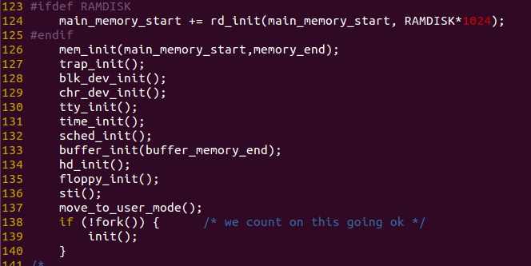

这段代码在进程 0 中运行，先切换到用户模式，然后全系统第一次调用 `fork()` 建立进程 1。进程 1 调用 `init()`。在 `init()` 中：

```c
setup((void *) &drive_info);        	// 加载文件系统
(void) open("/dev/tty0",O_RDWR,0);   	// 打开/dev/tty0，建立文件描述符0和/dev/tty0的关联
(void) dup(0);                				// 让文件描述符1也和/dev/tty0关联
(void) dup(0);                				// 让文件描述符2也和/dev/tty0关联
```

这段代码建立了文件描述符 0、1 和 2，它们分别就是 stdin、stdout 和 stderr。这三者的值是系统标准，不可改变。可以把 log 文件的描述符关联到 3。

文件系统初始化，描述符 0、1 和 2 关联之后，才能打开 log 文件，开始记录进程的运行轨迹。为了能尽早访问 log 文件，我们要让上述工作在进程 0 中就完成。所以把这一段代码从 `init()` 移动到 `main()` 中，放在 `move_to_user_mode()` 之后，同时加上打开 log 文件的代码。修改后的 `main()` 如下（这里 `open()` 缺少了个 ; 号）：

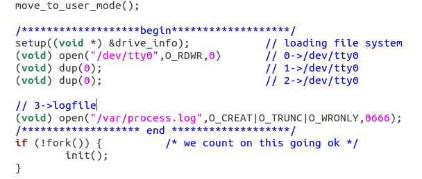

记得注释 `init()` 的初始化：

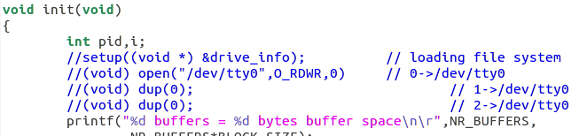


注意：这里需要在 var 目录下新建 process.log 文件。

### 写 log 文件的准备工作

1. 实现 `fprintk()` 函数以写 log 文件（在 `kernel/printk.c` 实现）：

   对 printk.c 进行补充：

   ```c++
   /*
    *  linux/kernel/printk.c
    *
    *  (C) 1991  Linus Torvalds
    */
   
   /*
    * When in kernel-mode, we cannot use printf, as fs is liable to
    * point to 'interesting' things. Make a printf with fs-saving, and
    * all is well.
    */
   #include <linux/kernel.h>
   #include <linux/sched.h>
   #include <stdarg.h>
   #include <stddef.h>
   #include <sys/stat.h>
   
   static char buf[1024];
   
   extern int vsprintf(char* buf, const char* fmt, va_list args);
   
   int printk(const char* fmt, ...) {
     va_list args;
     int i;
   
     va_start(args, fmt);
     i = vsprintf(buf, fmt, args);
     va_end(args);
     __asm__(
         "push %%fs\n\t"
         "push %%ds\n\t"
         "pop %%fs\n\t"
         "pushl %0\n\t"
         "pushl $buf\n\t"
         "pushl $0\n\t"
         "call tty_write\n\t"
         "addl $8,%%esp\n\t"
         "popl %0\n\t"
         "pop %%fs" ::"r"(i)
         : "ax", "cx", "dx");
     return i;
   }
   
   static char logbuf[1024];
   int fprintk(int fd, const char* fmt, ...) {
     va_list args;
     int count;
     struct file* file;
     struct m_inode* inode;
   
     va_start(args, fmt);
     count = vsprintf(logbuf, fmt, args);
     va_end(args);
   
     if (fd < 3) {
       __asm__(
           "push %%fs\n\t"
           "push %%ds\n\t"
           "pop %%fs\n\t"
           "pushl %0\n\t"
           "pushl $logbuf\n\t"
           "pushl %1\n\t"
           "call sys_write\n\t"
           "addl $8,%%esp\n\t"
           "popl %0\n\t"
           "pop %%fs" ::"r"(count),
           "r"(fd)
           : "ax", "cx", "dx");
     } else {
       if (!(file = task[0]->filp[fd])) {
         return 0;
       }
       inode = file->f_inode;
   
       __asm__(
           "push %%fs\n\t"
           "push %%ds\n\t"
           "pop %%fs\n\t"
           "pushl %0\n\t"
           "pushl $logbuf\n\t"
           "pushl %1\n\t"
           "pushl %2\n\t"
           "call file_write\n\t"
           "addl $12,%%esp\n\t"
           "popl %0\n\t"
           "pop %%fs" ::"r"(count),
           "r"(file), "r"(inode)
           : "ax", "cx", "dx");
     }
     return count;
   }
   ```
   
   `fprintk()` 的使用方法：
   
   ```c
   // 向 stdout 打印正在运行的进程的ID
   fprintk(1, "The ID of running process is %ld", current->pid);
   
   // 向 log 文件输出跟踪进程运行轨迹
   fprintk(3, "%ld\t%c\t%ld\n", current->pid, 'R', jiffies);
   ```
   
2. log 文件中的 time 指滴答数

3. 找到进程状态切换的时间点

   找到所有发生进程状态切换的代码点，并在这些点添加适当的代码，来输出进程状态变化的情况到 log 文件中。

   | 状态 | 编号 |
   | ---- | ---- |
   | 新建 | N    |
   | 就绪 | J    |
   | 运行 | R    |
   | 阻塞 | W    |
   | 退出 | E    |

   **写入信息是要判断进程状态是否真正的发生了改变。**那么很可能导致 “Error at line 31: It is a clone of previous line.”


### 寻找状态切换点

#### 无->新建

实现进程创建的函数是 `copy_process()`

位置：kernel/fork.c

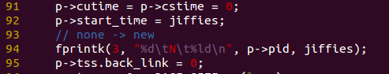

#### 新建->就绪

位置：kernel/fork.c

调用 **copy_process()** 函数实现创建进程

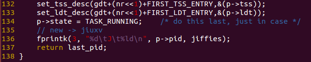

#### 就绪->运行 | 运行->就绪

程序的切换回包含两个进程的状态改变：

1. 原进程：从原状态变为就绪状态
2. 目的进程：从就绪状态变为运行状态

位置：kernel/sched.c

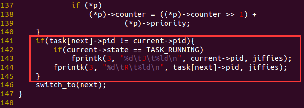


#### 阻塞->就绪

位置：kernel/sched.c

`schedule()` 函数中：

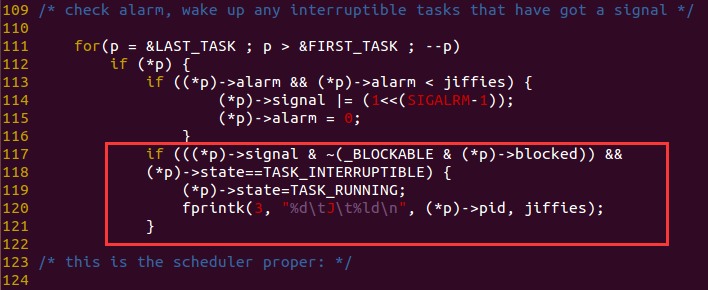

`wake_up()` 函数中：

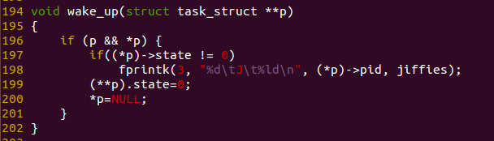

#### 运行->阻塞

##### 被动

位置：kernel/sched.c

`sleep_on()` 函数中：

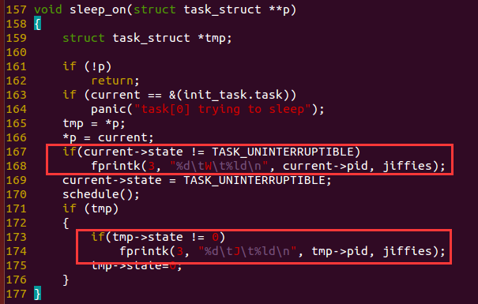

`interruptible_sleep_on()` 函数中：

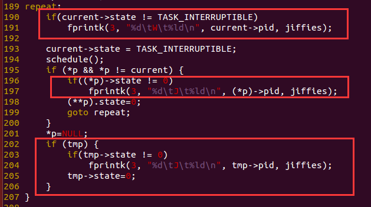

##### 主动

位置：kernel/sched.c

`sys_pause()` 函数中：

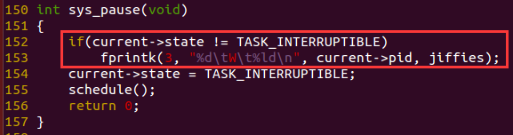


位置：kernel/exit.c

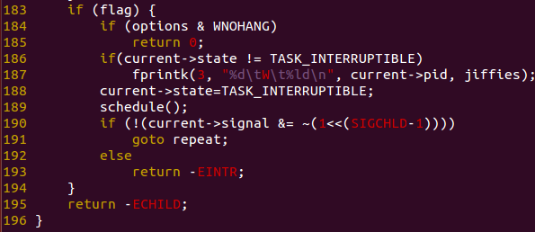

#### 运行->退出

位置：kernel/exit.c

`do_exit()` 函数中：

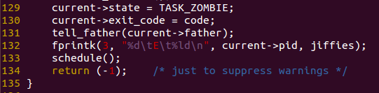

## 数据分析

这里我们通过挂载盘的形式导入：

1. 通过 `sudo ./mount-hdc` 的方式把 process.c 放到 linux-0.11环境下 的 root 目录中

   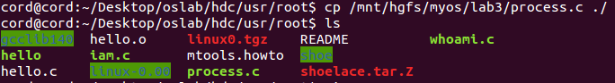

2. 在oslab目录下，`./run `运行 linux-0.11，然后在 linux-0.11 中编译运行 process.c

   编译程序：

   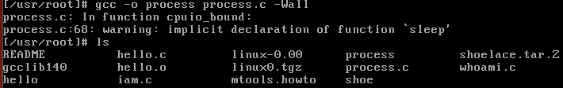

   执行程序：

3. 在 linux-0.11 的 shell 中输入 sync，写入磁盘

   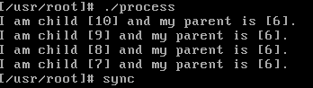

4. 通过 `sudo ./mount-hdc` 将 linux-0.11 环境下的 var 目录中的 process.log 文件拷贝到 ubuntu 中

   

5. 使用提供的数据分析脚本 stat_log.py 对数据进行分析

   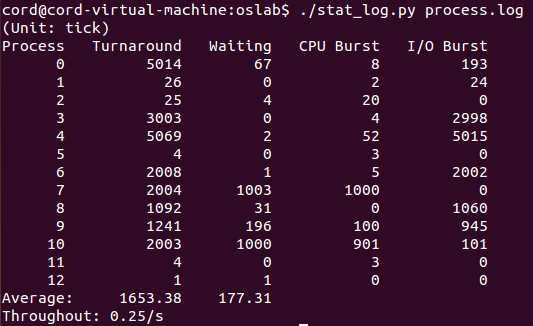


## 修改 0.11 进程调度的时间片

### 时间片

时间片的初值就是进程 0 的 priority，即宏 INIT_TASK 中定义的：

```c
#define INIT_TASK \
    { 0,15,15,
// 上述三个值分别对应 state、counter 和 priority;
```

进程 0 fork 出进程 1，此时的进程 0 的 counter（剩余的时间）显然不是初始值，所以用**进程 0 的 priotity 来设置进程 1 的初始counter**。进程 1 的 priority 继承进程 0。

当所有进程的 counter 等于 0 时，需要重置时间片，按照如下表达式：

```c
(*p)->counter = ((*p)->counter >> 1) + (*p)->priority;
```

由于 counter 为 0，所以，重置后，counter 为 priority 的值，因此优先级越高的进程时间片也越大。


修改 INIT_TASK，在 include/linux/sched.h：

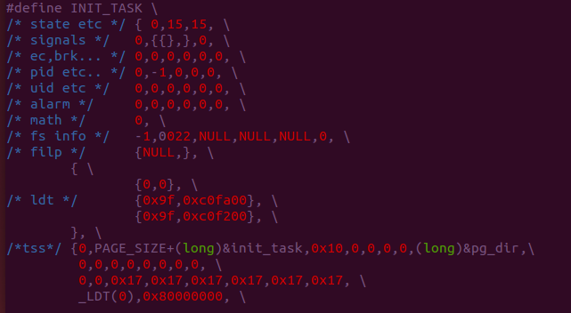

不同时间片会导致进程等待时间发生变化。

将时间片变小，进程之间的切换会更加频繁。可能导致进程在等待时间片重新分配的时候，花费更多时间在上下文切换上，会增加进程的等待时间

将时间片增大，进程之间的切换会较少。这可以减少上下文切换的开销，但可能会导致某些进程等待时间变长，因为它们必须等待更长时间才能获得 CPU 时间来执行任务
